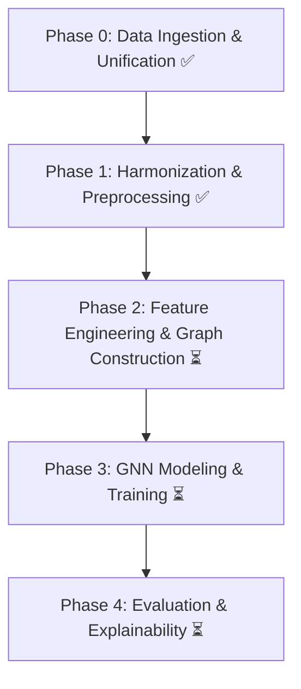

# 🧠 Automated Multiclass Diagnosis of Neuropsychiatric Disorders from Resting-State EEG using GNNs


[](https://www.python.org/downloads/release/python-390/)
[](./LICENSE)
[](https://github.com/Adxrsh-17/EEG-Detection-Alzheimer-s-FTD-MCI-MDD-GNN/actions)

---

## 📊 Project Workflow



---

## 📌 Project Overview

This project implements a **production-grade pipeline** for the automated diagnosis of four neuropsychiatric disorders:  

- **Alzheimer’s Disease (AD)**  
- **Frontotemporal Dementia (FTD)**  
- **Mild Cognitive Impairment (MCI)**  
- **Major Depressive Disorder (MDD)**  

using **resting-state EEG data** and **Graph Neural Networks (GNNs)**.

The core idea is to transform complex, multi-channel EEG time-series data into a **graph-based representation of brain connectivity**. This allows us to leverage GNNs to learn intricate patterns of neural synchronization that may be indicative of specific disorders.

The pipeline is **modular, robust, and reproducible**, unifying three distinct public datasets into a single, analysis-ready format suitable for advanced machine learning.

---

## 📌 Project Workflow & Status

The project is structured into several phases. ✅ indicates **completed**, ⏳ indicates **in progress/future work**.

---

### ✅ Phase 0: Data Ingestion & Unification  
**Concept**: Collect three disparate datasets and create a unified list of EEG recordings from the collected datasets.  

**Implementation**:  
- `code/create_metadata.py` → Generates `master_metadata.csv` as the single source of truth.  

---

### ✅ Phase 1: Harmonization & Preprocessing  
**Concept**: Standardize all EEG recordings and apply automated preprocessing for consistency.  

**Implementation**:  
- `code/harmonize_data.py` → Converts all recordings to **200Hz, 19 channels, Eyes-Closed state** in `.fif` format.  
- `code/validate_data.py` → Performs quality control to ensure integrity of signal and presence of required channels.  
- `code/preprocess_data.py` → Applies filtering, ICA-based artifact removal, and segmentation into **2-second clean epochs**.  

---

### ⏳ Phase 2: Feature Engineering & Graph Construction  
**Concept**: Transform clean EEG epochs into a **graph format** suitable for GNNs.  

**Planned Implementation**:  
- **Nodes**: 19 EEG channels.  
- **Node Features**: Extracted via **Empirical Wavelet Transform (EWT)** across EEG bands (Delta, Theta, Alpha, Beta, Gamma). Features include **spectral power** and **Shannon entropy**.  
- **Edges**: Functional connectivity via **Weighted Phase Lag Index (wPLI)**, yielding a **19×19 weighted adjacency matrix**.  

---

### ⏳ Phase 3: GNN Modeling, Training & Augmentation  
**Concept**: Train a **Graph Neural Network** to classify EEG graphs into AD, FTD, MCI, MDD, or CN.  

**Planned Implementation**:  
- **Data Splitting**: Subject-wise stratified split (train/val/test).  
- **Class Imbalance**: Use **SMOTE** + **weighted cross-entropy loss**.  
- **GNN Model**: **Graph Attention Network (GAT)** using *PyTorch Geometric*.  
- **Training**: k-fold cross-validation for hyperparameter tuning and robust evaluation.  

---

### ⏳ Phase 4: Evaluation & Explainability (XAI)  
**Concept**: Evaluate performance and interpret model decisions.  

**Planned Implementation**:  
- **Metrics**: Macro F1-Score, class-wise precision/recall, confusion matrix.  
- **Explainability**: **GNNExplainer** to identify influential brain regions and connections, highlighting **potential biomarkers**.  

---

## ⚙️ Setup & Installation

**Prerequisite**: Python **3.9+**

```bash
# Clone Repository
git clone <your-repository-url>
cd Neuropsychiatric_EEG_GNN_Final

# Create Virtual Environment
python -m venv venv

# Activate Environment
# On Windows:
venv\Scripts\activate
# On macOS/Linux:
source venv/bin/activate

# Install Dependencies
pip install -r requirements.txt
```
---

## 📂 Data Acquisition & Placement

This pipeline requires **three public datasets** which must be **downloaded manually**.  

⚠️ **Important**: After downloading and unzipping, place them into the correct subdirectories within the `data/raw/` folder.  
The scripts rely on the following exact structure:

```csharp
Neuropsychiatric_EEG_GNN_Final/
└── data/
    └── raw/
        ├── ds004504/
        │   ├── ... (files from OpenNeuro)
        │   └── .gitkeep
        │
        ├── caueeg/
        │   ├── ... (files from CAUEEG GitHub)
        │   └── .gitkeep
        │
        └── figshare_mdd/
            ├── ... (files from Figshare)
            └── .gitkeep
```

### ***Download Links and Instructions:***

- **Dataset 1: Alzheimer's & FTD (ds004504)**

Download from: [OpenNeuro ds004504](https://openneuro.org/datasets/ds004504)

Action: Place its contents into data/raw/ds004504/.

- **Dataset 2: Alzheimer's & MCI (CAUEEG)**

Download from: [CAUEEG GitHub](https://github.com/ipis-mjkim/caueeg-dataset)

Action: Place its contents into data/raw/caueeg/.

- **Dataset 3: Major Depressive Disorder (Figshare)**

Download from: [Figshare EEG Data](https://figshare.com/articles/dataset/EEG_Data_New/4244171)

Action: Place its contents into data/raw/figshare_mdd/.

---

## ▶️ Execution Pipeline (Completed Stages)

Run the following scripts sequentially from the project root (after activating venv).

Step A: Gather & Unify Raw Data (Phase 0)

```python
# Unify Metadata
python code/create_metadata.py
# Output: data/master_metadata.csv
```

Step B: Harmonize & Preprocess Data (Phase 1)

```python
# Harmonize Dataset
python code/harmonize_data.py
# Outputs:
#   - Cleaned files → data/processed/harmonized/
#   - Index file    → data/harmonized_metadata.csv

# Validate Harmonized Data
python code/validate_data.py

# Preprocess Harmonized Data
python code/preprocess_data.py
```
